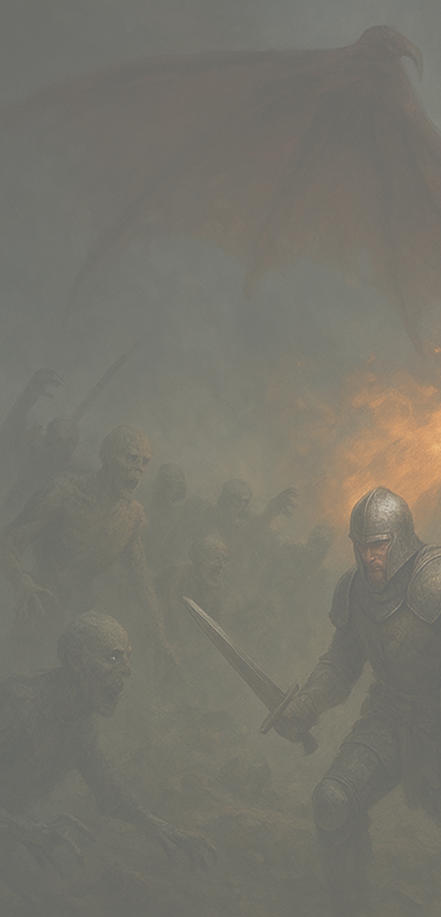

# RPGo! 🎲

<div align="center">
  
  
  <h3>Aplicativo completo para criação e gerenciamento de personagens de RPG</h3>
  
  [](https://flutter.dev)
  [](https://dart.dev)
  [](https://opensource.org/licenses/MIT)
</div>

## 📖 Sobre o Projeto

RPGo! é um aplicativo multiplataforma desenvolvido em Flutter para criação e gerenciamento de fichas de personagens de RPG baseado no sistema D&D 5ª Edição. Criado para facilitar a vida de jogadores e mestres, oferece uma interface intuitiva e recursos poderosos para dar vida aos seus personagens.

### 🎯 Características Principais

- ✅ **Criação Completa de Personagens**: Sistema guiado passo-a-passo
- ✅ **Cálculos Automáticos**: CA, modificadores, saving throws e proficiências
- ✅ **Gerenciamento de Equipamentos**: Inventário completo com categorização
- ✅ **Interface Temática Medieval**: Design imersivo com fontes personalizadas
- ✅ **Suporte Multilíngue**: Português e Inglês
- ✅ **Armazenamento Local**: Persistência de dados offline
- ✅ **Responsive Design**: Funciona em dispositivos móveis, tablets e web

## 🏗️ Estrutura do Projeto

```
app_rpg/
├── lib/
│   ├── models/              # Modelos de dados
│   │   ├── race_features.dart
│   │   ├── class_features.dart
│   │   ├── skills_data.dart
│   │   └── equipment_item.dart
│   ├── screens/             # Telas da aplicação
│   │   ├── home/
│   │   ├── character/       # Criação de personagem
│   │   ├── ficha_pronta/    # Ficha finalizada
│   │   ├── characters/      # Lista de personagens
│   │   ├── about/
│   │   └── support/
│   ├── utils/               # Utilitários
│   │   ├── app_localizations.dart
│   │   └── app_routes.dart
│   ├── assets/              # Recursos estáticos
│   │   └── images/
│   └── selection_manager.dart # Gerenciamento de estado
├── web/                     # Configurações web
├── android/                 # Configurações Android
├── ios/                     # Configurações iOS
└── pubspec.yaml
```

## 🚀 Funcionalidades

### Criação de Personagem
- **Seleção de Raça**: 9 raças disponíveis com características únicas
- **Escolha de Classe**: 12 classes com habilidades específicas
- **Antecedentes**: 13 backgrounds com perícias e equipamentos
- **Distribuição de Atributos**: Sistema de pontos (27 pontos)
- **Seleção de Perícias**: Baseado em classe, raça e antecedente

### Ficha de Personagem
- **Atributos e Modificadores**: Cálculo automático
- **Classe de Armadura**: Baseada em equipamentos e destreza
- **Pontos de Vida**: Calculados por classe e constituição
- **Proficiências**: Armas, armaduras e ferramentas
- **Equipamentos**: Sistema completo de inventário
- **Características Raciais**: Habilidades específicas por raça
- **Habilidades de Classe**: Recursos por nível

### Raças Disponíveis
- 🧙‍♂️ **Humano** - Versáteis e adaptáveis
- 🧝‍♀️ **Elfo** - Ágeis e mágicos
- 🛡️ **Anão** - Resistentes e corajosos
- 🏹 **Halfling** - Sortudos e ágeis
- 🐉 **Draconato** - Descendentes de dragões
- 🔬 **Gnomo** - Inventivos e curiosos
- 🎭 **Meio-Elfo** - Carismáticos e versáteis
- ⚔️ **Meio-Orc** - Fortes e determinados
- 😈 **Tiefling** - Misteriosos e carismáticos

### Classes Disponíveis
- ⚔️ **Bárbaro** - Fúria e resistência
- 🎵 **Bardo** - Inspiração e versatilidade
- ⛪ **Clérico** - Magia divina e cura
- 🌿 **Druida** - Natureza e transformação
- 🛡️ **Guerreiro** - Combate e táticas
- 🥊 **Monge** - Artes marciais e ki
- ⚡ **Paladino** - Justiça e proteção
- 🏹 **Patrulheiro** - Rastreamento e sobrevivência
- 🗡️ **Ladino** - Furtividade e precisão
- ✨ **Feiticeiro** - Magia inata
- 🔮 **Bruxo** - Pactos sobrenaturais
- 📚 **Mago** - Estudo e conhecimento

## 🛠️ Tecnologias Utilizadas

- **[Flutter](https://flutter.dev)** - Framework multiplataforma
- **[Dart](https://dart.dev)** - Linguagem de programação
- **[Google Fonts](https://pub.dev/packages/google_fonts)** - Tipografia personalizada
- **[Shared Preferences](https://pub.dev/packages/shared_preferences)** - Armazenamento local
- **[Path Provider](https://pub.dev/packages/path_provider)** - Gerenciamento de caminhos
- **[Image Picker](https://pub.dev/packages/image_picker)** - Seleção de imagens


## 🎨 Design e Interface

O RPGo! utiliza uma interface temática medieval com:
- **Paleta de Cores**: Tons escuros com detalhes em âmbar/dourado
- **Tipografia**: 
  - `Jim Nightshade` para títulos
  - `IM Fell English` para textos
  - `Cinzel` para elementos especiais
- **Layout Responsivo**: Adaptável a diferentes tamanhos de tela
- **Animações Fluidas**: Transições suaves entre telas

## 🌐 Internacionalização

O aplicativo suporta múltiplos idiomas através do sistema de localização:
- 🇧🇷 **Português** (padrão)
- 🇺🇸 **English**

Para adicionar novos idiomas, edite o arquivo [`lib/utils/app_localizations.dart`](lib/utils/app_localizations.dart).

## 📦 Estrutura de Dados

### Modelos Principais
- **[`RaceFeature`](lib/models/race_features.dart)** - Características raciais
- **[`ClassFeature`](lib/models/class_features.dart)** - Habilidades de classe
- **[`Skill`](lib/models/skills_data.dart)** - Sistema de perícias
- **[`EquipmentItem`](lib/models/equipment_item.dart)** - Itens e equipamentos
- **[`CharacterModel`](lib/models/character_model.dart)** - Modelo completo do personagem

### Gerenciamento de Estado
O [`SelectionManager`](lib/selection_manager.dart) utiliza o padrão Singleton para gerenciar o estado global da aplicação durante a criação do personagem.

## 📄 Licença

Este projeto está licenciado sob a Licença MIT - veja o arquivo [LICENSE](LICENSE) para detalhes.

## 👥 Autores

<table>
  <tr>
    <td align="center">
      <a href="#">
        <br>
        <sub><b>Nayara Stephanie S. Silva</b></sub>
      </a>
    </td>
    <td align="center">
      <a href="#">
        <br>
        <sub><b>Victor Peaguda Bekcivanyi</b></sub>
      </a>
    </td>
  </tr>
</table>

## 🎓 Agradecimentos

- **Fatec Ribeirão Preto** - Instituição de ensino
- **Disciplina**: Programação para Dispositivos Móveis
- **D&D 5ª Edição** - Sistema de RPG que inspirou o projeto
- **Comunidade Flutter** - Recursos e bibliotecas utilizadas

<div align="center">
  <p><em>Que sua jornada seja épica e suas aventuras inesquecíveis! 🐉⚔️</em></p>
  
  **Desenvolvido com ❤️ usando Flutter**
</div>
